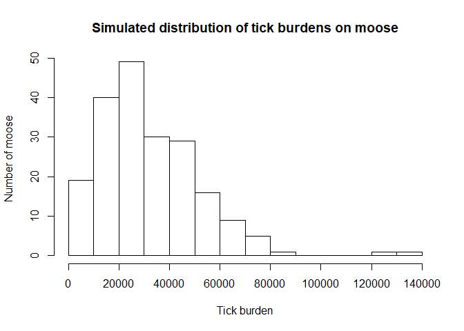
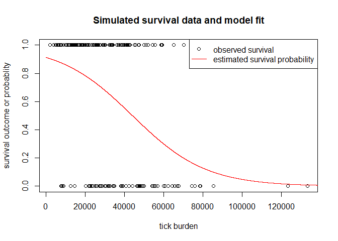
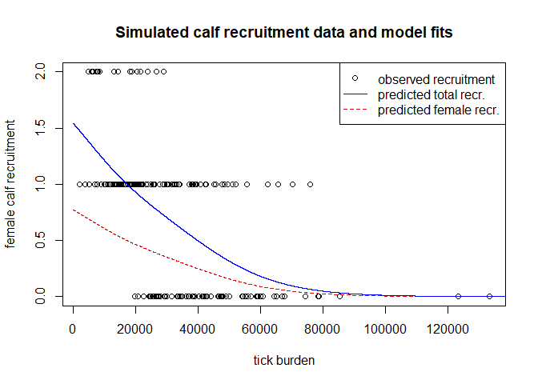
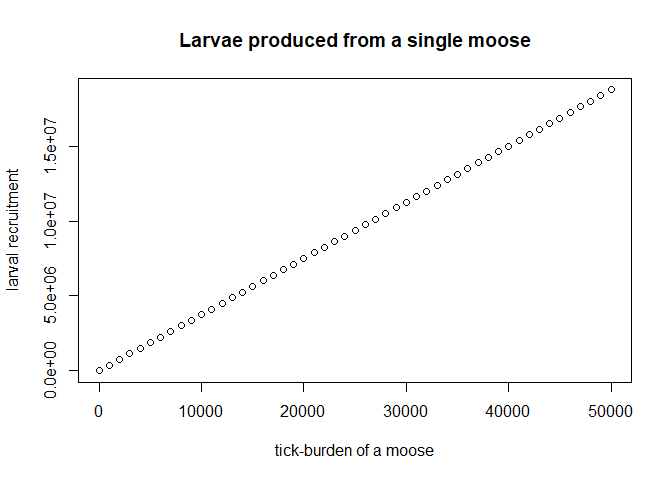
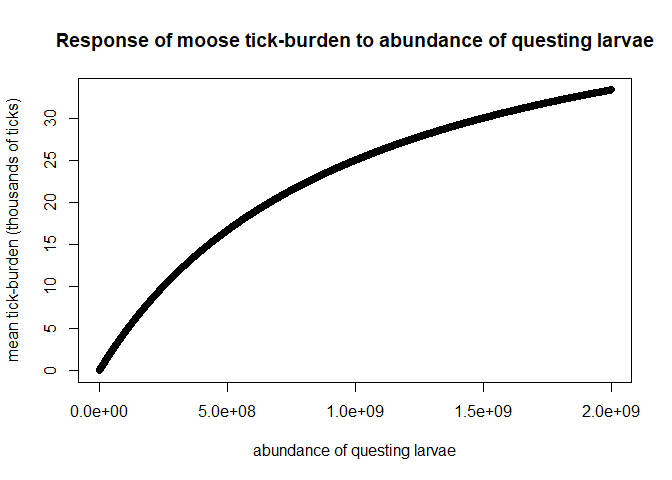
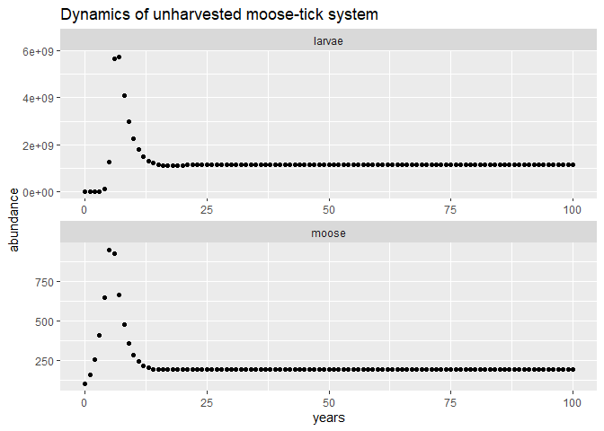
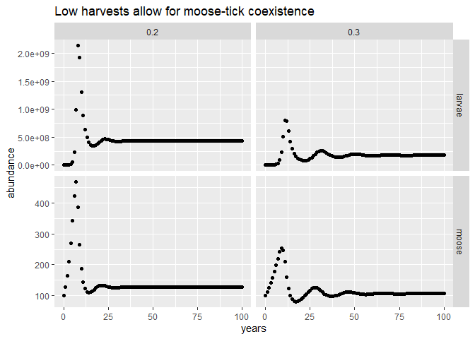
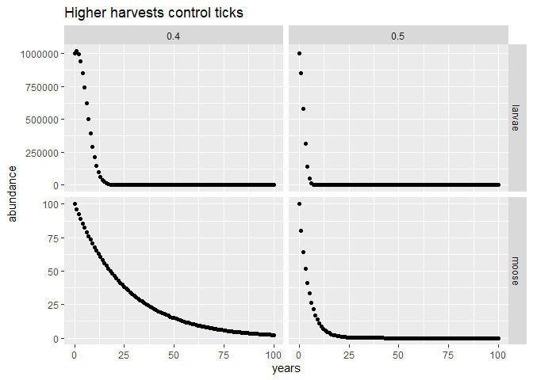

## Purpose

<!-- Models that adequately describe interactions between moose and winter ticks would be useful for evaluating the proposed use of harvesting to mitigate tick outbreaks. -->
<!-- Modeling the interactions between moose and winter ticks would be useful for evaluating the proposed use of harvesting to mitigate tick outbreaks. -->
<!-- Models are useful for evaluating if wildlife management strategies can achieve management goals. Here, I propose an extension of matrix models that can be used to determine if and when harvesting can control winter tick outbreaks among moose populations.  -->

Population models of moose-tick interactions would be useful to determine if and when harvesting can control winter tick outbreaks. The premise for using harvesting to manage winter ticks is that if population growth of ticks depends on the availability its primary host, moose, then reducing moose populations through harvesting should decrease tick population growth rates and prevents outbreaks. This hypothesis results in the counter-intuitive argument that maintaining or increasing harvests can facilitate recovery of moose populations that are subject to frequent tick outbreaks. Through analysis of data-driven population models of moose and winter ticks, we can rigorously test the verbal argument for harvesting and determine the potential for harvesting to achieve management objectives. 

For this purpose -- I developed an extension of the matrix modeling framework commonly used for moose -- the burden-structured model. In the following sections I describe the rationale and structure of the proposed model, data requirements for estimation of model parameters, and examples of model output under different harvesting strategies.
 <!-- The two advantages of burden-structured models is that the model accounts for variation in tick-burden and connects the population dynamics of ticks to moose, which are necessary for modeling how harvesting might control tick outbreaks. This is because the scientific reasoning behind using harvesting to control tick outbreaks is that harvesting will reduce moose populations below sizes needed for persistence of ticks. Therefore we must use models that directly relate moose population size and tick-burden distribution to tick population dynamics if we want to evaluate harvesting as a management strategy. -->
<!-- This is because the effect of harvesting on tick population dynamics is indirect -- if harvesting has an effect of tick outbreak potential it is because outbreaks depend on the size of moose populations and/or the distribution of tick-burden. -->

<!-- Preliminary modeling results shown here provide theoretical justification for using harvesting to control winter tick outbreaks. -->
<!-- A modeling framework that can be used to evaluate how moose harvesting impacts winter tick outbreaks would be useful for assessing outcomes of proposed management actions. To model the potential impacts of harvesting on tick outbreaks we must model the interactions and feedbacks between the population dynamics of moose and the population dynamics of ticks. The inclusion of this interaction between moose and ticks will allow us to mechanistically model how increased harvests could influence tick outbreak frequency and severity. Models that don’t include the mechanisms that connect the effect of moose abundance on tick recruitment cannot be used to assess the impact of harvesting on tick outbreaks since these models have no link between moose density and tick population size/distribution among moose. -->

## Rationale for burden-structured model

The simplest population models describe how population-average birth and death rates dictate changes in a population over time. However, variation between individuals causes variation in survival and reproduction (vital rates) among individuals. For instance, vital rates of a particular animal commonly depend on characteristics like stage (e.g., calf, yearling, adult), age, and/or size. This is the motivation behind matrix population models which structure populations into discrete classes based on a variable like size. By accounting for realistic variation, structured models can be connected to empirical data and generate more accurate projections. 

Since tick-burden varies among moose and the fitness consequences suffered by each moose varies depending on the numbers of ticks it carries, we need to explicitly model variation in tick-burden. Using burden-structured models, we can then estimate how much individual-level moose survival and reproduction decreases with tick-burden, and make model projections to reveal the population-level consequences of winter ticks on moose. By modeling variation in tick-burden, these models also make it possible to connect moose and tick population dynamics. This is because the numbers of questing larvae each fall depends on the numbers of ticks feeding on moose the previous year, which is obtained in the model by summing the tick-burdens over the moose population from the previous year. By including this dependence of tick recruitment on moose abundance and tick-burden we can assess the hypothesis that harvesting can be used to manage ticks.

Overall, this approach will allow us to simultaneously account for the impact of tick-burdens on moose vital rates and the joint impact of moose population size and tick-burden distribution on tick recruitment. This constitutes the set of ecological interactions needed to connect harvesting actions to management outcomes. The versatility of structured population models also allows for the inclusion of additional population structure and environmental covariates if there is adequate data. Furthermore, the output and structure of burden-structured models should be straight-forward to interpret for moose biologists and managers since burden-structured models share the ideas underlying the matrix population models commonly used in moose population assessment.

## Model structure and assumptions

The model tracks two state variables over time, the abundance of ticks in the environment (questing larvae) and numbers of adult moose cows. Events in the model follow a simplified version of the annual sequence of interactions between moose and winter ticks. The following five events happen within each annual time step of the model.

1. *Moose acquire ticks from the environment.* 
    + The resulting distribution of burdens is assumed to be have a negative binomial distribution; the negative binomial distribution is used because it allows for high variation in burden (over-dispersion) which is common for parasites like ticks [@shaw_patterns_1995]. 
    + The mean of the burden distribution was assumed to increase with questing larval abundance, i.e., if there are many questing larvae in the environment moose will acquire more ticks which increases the average tick-burden among the moose population. The functional form relating abundance of questing larvae and the mean moose burden should be determined from empirical data.

2. *A proportion of moose is harvested.* 
    + The probability of being harvested is assumed to be independent of burden. 

3. *Moose die from natural mortality or tick feeding.* 
    + There is a constant probability of dying from non-tick related causes.
    + The effect of ticks on the probability of dying is in addition to the constant probability of death in the absence of tick infestation.

4. *Ticks detach from moose and lay eggs.* 
    + The expected proportion of ticks that are engorged females lay eggs. Of the laid eggs, some proportion successfully eclose and will be recruited as questing larvae in the subsequent year.

5. *Moose give birth to calves (only females are tracked).* 
    + Note, this current model does not include stage-structure, so moose are immediately recruited into the adult class.
    + Moose recruitment is currently density-independent in this model, so moose population in this model grows or declines exponentially when ticks are absent.

<!-- insert image of model structure here -->

<!-- Mathematical details of the model are in the appendix. -->

## Data requirements

To model both tick and moose population dynamics we need to know three properties of this host-parasite system:

1. *How variation in tick burden affects moose survival and reproduction.*

This can be determined from measurements of tick-burden, survival, and reproduction of individuals over time by regressing tick-burden onto survival and calving. These estimates can then be used to construct population projection matrices for the burden-structured model. An example of this is shown in the following section for simulated data.

2. *The expected number of larval ticks recruited per moose with a certain tick-burden.*

Previous work on tick recruitment could be used to to inform estimates of larval tick recruitment. While the studies tend to be small, and have little replication or control, they will still be useful as a starting place for preliminary modeling and later on as priors for Bayesian estimation of parameters.
    
<!-- it may be possible to also estimate these params during model fitting to time series data -->

3. *How density/abundance of questing larvae impacts the acquisition and distribution of tick burdens among moose.* 

This is the most challenging question to answer, but is critical for modeling tick epidemiology. Parameters for this process may be estimated given longitudinal data of moose population abundances and "snapshots" of tick burdens over time. That is, tick counts from harvested moose and/or winter-kill. By combining these data with the proposed burden-structured model, it may be possible to determine tick transmission parameters using Bayesian hierarchical modeling [@hobbs_bayesian_2015]. This would require further development of some previous work on estimating parameters for structured population models [@ghosh_inference_2012]. Developing parameter estimation methods from these data for burden-structured models would be an important advance for disease ecology since many human and agricultural diseases have burden-dependent pathology and "snapshot" types of data.

<!-- The model can be parameterized from individual- or population-level data. --> 

<!-- Another type of data that would be useful is longitudinal data of moose population abundances and "snapshots" of tick burdens over time. That is, tick counts from harvested moose and/or winter-kill. By combining these data with the proposed burden-structured model, it may be possible to determine tick transmission parameters using Bayesian hierarchical modeling approaches (Hobbs and Hooten). This would require further development of some previous work on estimating parameters for structured population models (Ghosh et al.) and would be an important contribution for modeling diseases. -->

## Parameterization

### Estimating impact of tick-burden on survival and calving

I use a simulated data set to demonstrate how parameters could be estimated from individual-level observations of cow moose. The data set consists of measurements of tick-burden, survival, and calving. Tick burden was simulated following a negative binomial distribution (mean = 33,000 ticks/moose, dispersion parameter (k) = 3). Modeling burden as negative binomial distributed is supported by previous work on parasite aggregation [@shaw_patterns_1995]. The parameters were chosen to qualitatively match a histogram of winter tick burdens among moose presented by @samuel_white_2004. Each of the moose in the simulated data set were then assigned a survival outcome and number of calves produced. Survival outcomes and number of calves were assigned from binomial and multinomial distributions, respectively. Probabilities of survival and calving were assumed to be decreasing functions of tick burden. 

Parameter estimates were obtained from the simulated data by regressing survival or number of calves onto moose burden. I used logistic regression to estimate survival probabilities and multinomial regression to estimate the expected number of calves. The parameter estimates were used to parameterize projection matrices for the burden-structured model. The simulated data and model fits for the data are shown in the following figures.

<!-- -->

<!-- -->

<!-- -->

### Parameters for larval tick recruitment

To determine the number of larvae that are recruited from each moose, we need to take the product of the following quantities: the proportion of ticks on a moose that are engorged females, the average number of eggs each engorged female lays, and the expected proportion of those eggs from which larvae eclose and survive until the fall questing season. For the model shown here, I assumed that 25 % of the ticks on a moose survived to become engorged females based on a point estimate reported by @samuel_white_2004. These surviving engorged females each lay an expected 5,000 eggs which is the upper-bound of winter tick egg-laying [@drummond_biology_1969]. I arbitrarily set larval eclosion and survival at 30 % of total eggs, since the controlled studies I have read did not measure eclosion success. These rough estimates and assumptions result in 375 larvae recruited per infesting tick. Below is a plot showing how larval recruitment per moose increases with the moose's tick-burden.

Note that I'm assuming that larval recruitment is density-independent. That is, there is no difference when comparing the expected number of larvae produced from an engorged female tick from a lightly-infested moose to one from a heavily-infested moose.  Previous work has shown no evidence of density-dependence for tick-burdens ranging between 20,000-40,000 [@addison_growth_1988], however, this may not be true when infestations are heavier. The assumption of density-independent larval recruitment may bias the model by making tick control harder to achieve.

<!-- -->

### Parameters for tick-attachment to moose

For the tick-attachment process there are at least 3 parameters that need to be estimated. The first two are the mean and shape parameters of the negative binomial distribution which controls the distribution of ticks among moose in this model. At least one or more additional parameters is needed to describe the relationship between the abundance of questing larvae in the environment and the mean tick-burden. For the model shown here, I assume a simple functional form which only has one additional parameter. Since I have no data and I haven't found relevant findings in the literature I just chose parameter values that seemed reasonable based on model output. Ideally, the functional form and parameters would be determined from empirical data meeting the conditions outlined previously in *Data Requirements*.

<!-- -->

## Model output example

In this section, I present some model projections for different levels of harvesting. These projections use the model structure, assumptions, and parameterizations presented above. Of course, it wouldn't be appropriate to make any claims about how harvesting might impact an actual moose-tick system until the model is parameterized with real data. However, these theoretical results demonstrate how this model can be used to assess alternative winter tick management strategies if it were parameterized with additional empirical data.

In all simulations I initialize the system with $10^6$ questing larvae and $100$ moose. I then examined how different proportions of constant harvesting impacted moose populations and tick persistence. In the following figures the abundances of questing larvae are presented in the top row and moose abundance in the bottom row. The columns in each plot are the different proportional annual harvest rates for moose, e.g., 0.1 means that a 10 % annual moose harvest was used in the simulation.

<!-- -->

In the absence of harvesting, moose were stably regulated by winter ticks. The transient "spikes" in both tick and moose abundance are likely artifacts caused by the assumption of density-independent moose population growth. This is because at the beginning of the simulation, there are too few ticks to regulate moose so they grow exponentially until tick burdens become heavy enough to regulate moose population growth.

<!-- -->

At low levels of harvest ($0 <harvest \leq 0.3$) the results are similar to the no harvest strategy. The main difference is that moose and ticks coexist at lower abundances than the unharvested case. These low levels of harvest also produced damped oscillations in moose and tick abundances which indicates that harvesting is destabilizing.

<!-- -->

At higher levels of harvest ($0.3 < harvest \leq 1$) both moose and ticks populations decline to zero. But, notice that for intermediate harvesting intensities (0.4 and 0.5)  ticks died out sooner than the moose. This indicates that harvesting can theoretically be used to control winter ticks. This result is an emergent property of the feedback between moose population size and tick recruitment. Since constant harvesting strategies caused extirpation of both moose and ticks, it would be useful to model harvesting strategies that varied with time or were dependent on moose population size.

Using time- or state-dependent harvesting was proposed by @samuel_white_2004 to control tick outbreaks by dynamically regulating moose populations below levels which allow for tick outbreaks. However, the success of this approach depends on knowing the critical thresholds where tick outbreaks can occur so that moose populations can be managed below it. By parameterizing the burden-structured models I developed here with field data, it may be possible to estimate the critical moose population thresholds for winter tick outbreaks in a way similar to how herd-immunity thresholds are estimated for vaccine-preventable human diseases. Dynamic optimization methods [stochastic dynamic programming; @marescot_complex_2013] could be then used to develop state-dependent harvesting strategies to meet specific management objectives.

##### page break
## References

<!-- stop knitting here -->

<!-- ## Supplementary tables -->

