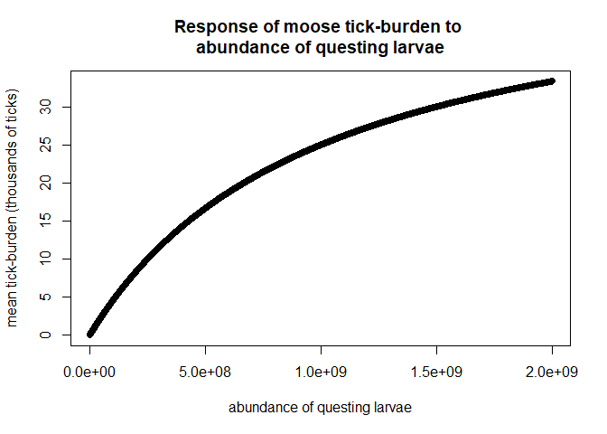

## Purpose

A modeling framework that can be used to evaluate how moose harvesting impacts winter tick outbreaks would be useful for assessing outcomes of proposed management actions. To model the potential impacts of harvesting on tick outbreaks we must model the interactions and feedbacks between the population dynamics of moose and the population dynamics of ticks. The inclusion of this interaction between moose and ticks will allow us to mechanistically model how increased harvests could influence tick outbreak frequency and severity. Models that don’t include the mechanisms that connect the effect of moose abundance on tick recruitment cannot be used to assess the impact of harvesting on tick outbreaks since these models have no link between moose density and tick population size/distribution among moose.

In the following sections I describe the rationale and structure of the proposed model, data requirements for estimation of model parameters, and examples of model output under different harvesting stratwgies.

## Rationale for burden-structured model

The simplest population models describe how population-average birth and death rates dictate changes in a population over time. However, individuals may differ such that the rates of survival and reproduction (vital rates) are not the same for every individual in a population, such that averaging across population is inappropriate. For instance, vital rates of a particular animal may depend on characteristics like stage (e.g., calf, yearling, adult), age, and/or size. This is the motivation behind matrix population models which “structure” populations into discrete classes based on a variable like stage which allows individuals in different stage classes to have different vital rates. 

We can extend these structured population models to develop models which structure a moose population according to tick burden, such that moose vital rates will depend on their burden. This burden-structured model makes it straightforward to model the expected recruitment of questing larval in the following year given information about the current year’s burden distribution and existing estimates of tick recruitment per engorged female tick. Overall, this approach will allow us to simultaneously account for the impact of variable tick burdens on moose vital rates and the joint impact of moose population size and tick burden distribution on tick recruitment. This is critical for understanding how harvesting might alter tick outbreaks. Moreover, modelling results will be easier to interpret for moose researchers and managers since burden-structured models share the ideas underlying the matrix population models commonly used in moose population assessment.

## Model structure and assumptions

The model includes two state variables (quantities we track over time), the abundance of ticks in the environment (questing larvae) and numbers of adult moose cows. The moose population is structured according to tick-burden during the winter and is unstructured at other times. 

Events in the model follow a simplified version of annual sequence of interactions between moose and winter ticks. For each annual time step of the model, the following five events are simulated.

1. Moose acquire ticks from the environment. 
    + The resulting distribution of burdens is assumed to be have a negative binomial distribution; the negative binomial distribution is used to because it allows for overdispersion which is common for parasites like ticks (Shaw and Dobson, 1999). 
    + The mean of the burden distribution was assumed to increase with questing larval abundance, i.e., if there are many questing larvae in the environment moose will acquire more ticks which increases the average tick-burden among the moose population. 

2. A proportion of moose is harvested. The probability of being harvested is assumed to be independent of burden. 

3. Moose die. The probability of survival depends on tick-burden.

4. Ticks drop from moose. The expected proportion of ticks that are engorged females lay eggs. Of the laid eggs, some proportion succesfully eclose and will be recruited as questing larvae in the subsequent year.

5. Moose give birth to calves (zero, one, or two). The expected number of calves per moose depends on their previous tick-burden such that heavily-infested moose are more likely to give birth to no calves whereas lightly-infested moose are more likely to give birth to twins.
    + Note, this current model does not include stage-structure, so moose are immediatly recruited into the adult class.

Mathematical details of the model are in the appendix.

## Data requirements

To model both tick and moose population dynamics we need to know three properties of this host-parasite system:

1. How variation in tick burden affects moose survival and reproduction.
    + This can be determined from measurements of tick-burden, survival, and reproduction of individuals over time by regressing tick-burden onto survival and calving. These estimates can then be used to construct population projection matrices for the burden-structured model. An example of this is shown in the following section for simulated data.

2. The expected number of larval ticks recruited per moose with a certain tick-burden.
    + Previous work on tick recruitment (Addison ; Samuel) could be used to to inform estimates of larval tick recruitment. However, these data do not provide any information on potential density dependent effects on tick recruitment, e.g., if moose with high tick-burdens have a lower larval recruitment per-engorged-female than moose with lower burdens due to competition.
    
3. How density/abundance of questing larvae impacts the acquisition and distribution of tick burdens among moose. 
    + This is the most challenging question to answer, but is critical for modeling tick epidemiology. Parameters for this process may be estimated given longitudinal data of moose population abundances and "snapshots" of tick burdens over time. That is, tick counts from harvested moose and/or winter-kill. By combining these data with the proposed burden-structured model, it may be possible to determine tick transmission parameters using Bayesian hierarchical modeling approaches (Hobbs and Hooten). This would require further development of some previous work on estimating parameters for structured population models (Ghosh et al.) and would be an important contribution for modeling diseases.

<!-- The model can be parameterized from individual- or population-level data. --> 

<!-- Another type of data that would be useful is longitudinal data of moose population abundances and "snapshots" of tick burdens over time. That is, tick counts from harvested moose and/or winter-kill. By combining these data with the proposed burden-structured model, it may be possible to determine tick transmission parameters using Bayesian hierarchical modeling approaches (Hobbs and Hooten). This would require further development of some previous work on estimating parameters for structured population models (Ghosh et al.) and would be an important contribution for modeling diseases. -->

## Parameter estimation

### Estimating impact of tick-burden on survival and calving

I use a simulated data set to demonstrate how parameters could be estimated from individual-level observations of moose cow tick-burden, survival, and calving. The simulated data set consists of 200 observations of moose with tick loads following a negative binomial distribution (mean = 33,000 ticks/moose, dispersion parameter (k) = 3). The assumption that burden is negative binomial distributed is supported by previous work on parasite aggregation (Shaw and Dobson, 1999). The parameters were chosen to qualitatively match a histogram of winter tick burdens among moose presented by Samuel (2004). Each of the moose in the simulated data set were then assigned a survival outcome and number of calves produced. Survival outcomes and number of calves were assigned from binomial and multinomial distributions, respectively. Probabilities of survival and calving were assumed to be decreasing functions of tick burden. 
Parameter estimates for the burden structured model were obtained by regressing survival or number of calves onto moose burden. I used logistic regression to estimate survival probabilities and multinomial regression to estimate the expected number of calves. The parameter estimates were used to parameterize projection matrices for the burden-structured model. The simulated data and model fits for the data are shown in the following figures.

<!-- -->

<!-- -->

<!-- -->

### Parameters for larval tick recruitment

To determine the number of larvae that are recruited from each moose, we need to take the product of the following quantities: the proportion of ticks on a moose that are engorged females, the average number of eggs each engorged female lays, and the expected proportion of those eggs from which larvae eclose and survive until the fall questing season. For the model shown here, I assumed that 25 % of the ticks on a moose survived to become engorged females based on point estimate reported by Samuel (2004). These surviving engorged females each lay an expected $5,000$ eggs which is the upper-bound of winter tick egg-laying (Drummond et al., 1969). I arbitrarily set larval eclosion and survival at 30 % of total eggs, since the controlled studies I have read did not measure eclosion success. These rough estimates and assumptions result in 375 larvae recruited per infesting tick. Below is a plot showing how larval recruitment per moose increases with the moose's tick-burden.

<!-- -->

### Tick-acquisition process and parameters

<!-- -->

## Model output example

In this section, I present some model projections for different levels of harvesting. These projections use the assumptions and hypothetical parameterizations presented above. It wouldn't be appropriate to make any claims about how harvesting might impact an actual moose-tick system Until the model is parameterized with real data from that system. However, the projections shown here do provide a sense of the theoretical outcomes of using harvesting for tick management and demonstrate the potential for using a parameterized version of this model to evaluate how harvesting might impact winter tick outbreaks in real systems.

In all simulations I initialize the system with $10^6$ questing larvae and $100$ moose. I then examined how different proportions of constant harvesting impacted moose populations and tick persistence. In the following figures the abundances of questing larvae are presented in the top row and moose abundance in the bottom row. The columns in each plot are the different proportional annual harvest rates for moose, e.g., 0.1 means that a 10 % annual moose harvest was used in the simulation.

<!-- -->

In the absence of harvesting, moose can be stably regulated by winter ticks.

<!-- -->

At low levels of harvest ($0 <harvest \leq 0.3$) moose and ticks coexist at lower abundances than the unharvested case. These low levels of harvest also produced damped oscillations.

<!-- -->

At higher levels of harvest ($0.3 < harvest \leq 1$) both moose and ticks were extirpated. However, for intermediate harvesting intensities (0.4 and 0.5)  ticks died out sooner than the moose. This indicates that harvesting can be used to control winter ticks and that time and state dependent harvesting strategies may be promising strategies for controlling winter ticks. 

Using state-dependent harvesting intensities to preemptively reduce moose populations prior to expected tick outbreaks were proposed in Samuel 2004. But this approach to tick management depends on knowing the appropriate thresholds at which tick outbreak occur. It may be possible to estimate these thresholds by parameterizing the burden-structured models I developed here and using optimization methods (stochastic dynamic programming) to identify state-dependent harvesting strategies for managing winter tick outbreaks.

<!-- stop knitting here -->

<!-- ## Supplementary tables -->

